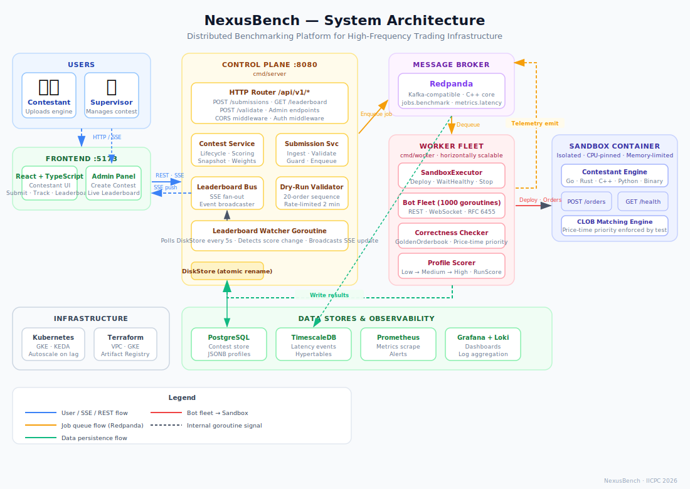
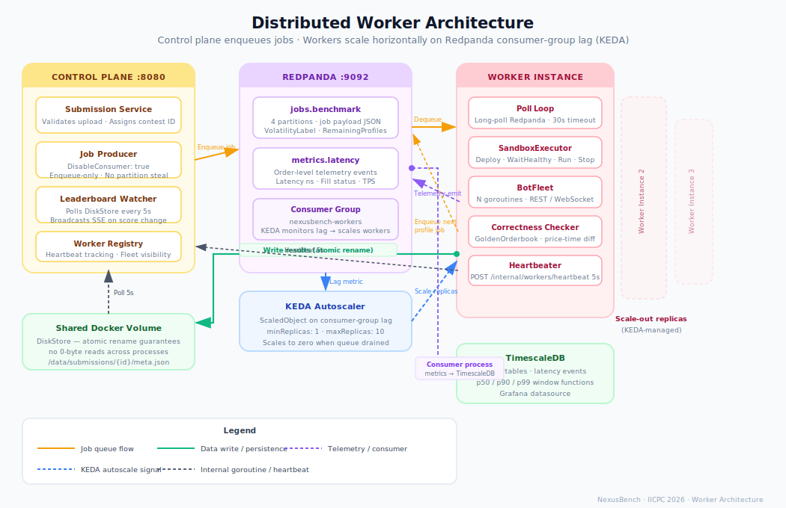
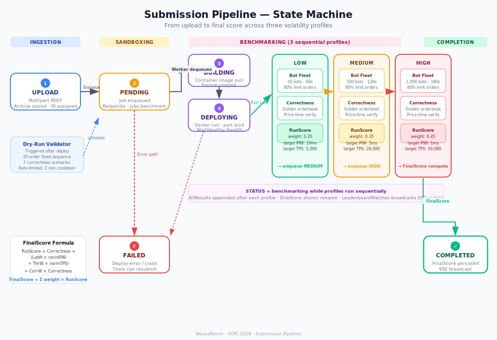
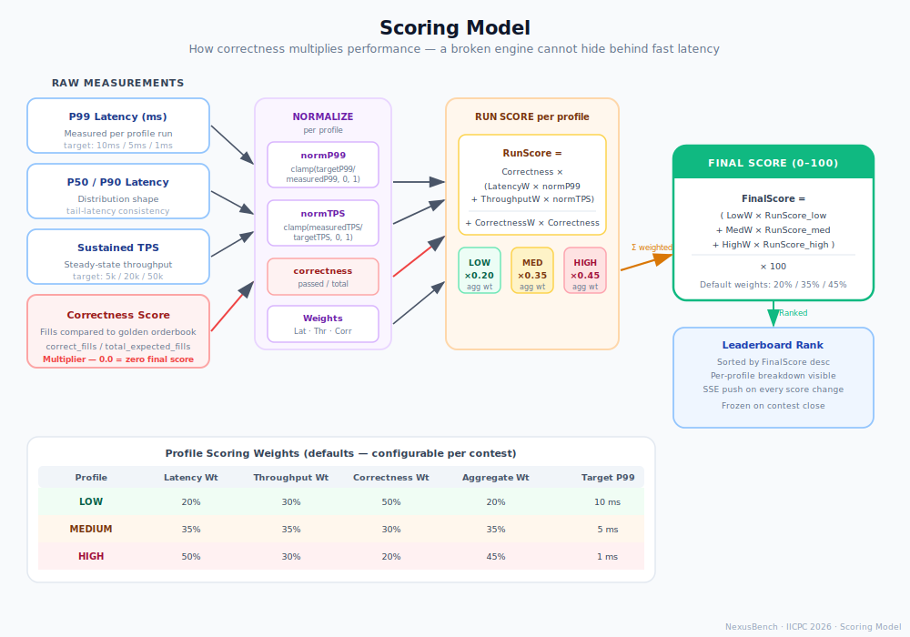
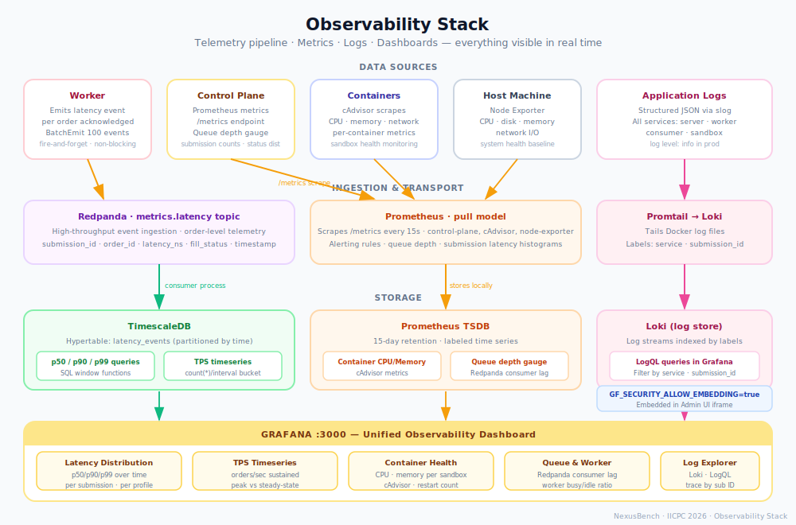

# NexusBench — Architecture & Engineering Decision Record

> **Audience:** Technical engineers, system architects, and AI agents working on or evaluating this codebase.
> This document is the definitive record of how NexusBench was designed, what tradeoffs were made at each phase, and why the system looks the way it does today. Read this before touching any code.

---

## Table of Contents

1. [What NexusBench Is](#1-what-nexusbench-is)
2. [The Core Problem This Solves](#2-the-core-problem-this-solves)
3. [Architectural Principles](#3-architectural-principles)
4. [System Overview](#4-system-overview)
5. [Phase 1 — Core MVP](#5-phase-1--core-mvp)
6. [Phase 2 — Telemetry Pipeline](#6-phase-2--telemetry-pipeline)
7. [Phase 3 — Distributed Workers](#7-phase-3--distributed-workers)
8. [Phase 4 — Infrastructure Automation](#8-phase-4--infrastructure-automation)
9. [Phase 5 — Advanced Benchmarking](#9-phase-5--advanced-benchmarking)
10. [Phase 6 — Frontend](#10-phase-6--frontend)
11. [Phase 7 — Pre-flight Validator Gate](#11-phase-7--pre-flight-validator-gate)
12. [Scoring Model](#12-scoring-model)
13. [Submission Pipeline State Machine](#13-submission-pipeline-state-machine)
14. [Observability Stack](#14-observability-stack)
15. [Key Bugs Fixed and Why They Mattered](#15-key-bugs-fixed-and-why-they-mattered)
16. [Known Limitations and Honest Tradeoffs](#16-known-limitations-and-honest-tradeoffs)
17. [Submission Contract](#17-submission-contract)

---

## 1. What NexusBench Is

NexusBench is a **distributed benchmarking and contest platform for Central Limit Order Book (CLOB) matching engines**, built for the IICPC Summer Hackathon 2026 (May 9 – June 10).

A contestant uploads a matching engine written in Go, Rust, C++, Python, or as a precompiled binary. NexusBench:

1. Sandboxes the engine in an isolated container with dedicated CPU and memory limits
2. Runs three sequential benchmark jobs — Low, Medium, and High volatility — each with an independently tuned bot fleet
3. Measures p50/p90/p99 latency, sustained TPS, and correctness against a golden reference orderbook per run
4. Computes a weighted composite score across all three runs
5. Streams the ranked leaderboard to every connected browser in real time via Server-Sent Events

**What is being evaluated:** NexusBench evaluates CLOB matching engine correctness and performance under load. It does not evaluate trading strategies, portfolio managers, or execution algorithms. The engine must accept orders, maintain a price-time priority orderbook, and return fills correctly — at increasing concurrency.

**What is not evaluated:** the engine's trading logic, its position management, or anything beyond the matching layer. A matching engine that accepts every order and produces correct fills at 50,000 TPS will outscore one that runs a sophisticated strategy but produces incorrect fills.

---

## 2. The Core Problem This Solves

Evaluating high-frequency trading infrastructure has two hard subproblems that most platforms treat separately:

**Correctness is hard to verify under load.** An engine can behave correctly at low concurrency and silently corrupt its orderbook at 10,000 orders/second. Standard load testing tools (Locust, k6, Gatling) measure throughput and latency but have no concept of trading correctness.

**Performance is meaningless without correctness.** Sub-millisecond P99 latency means nothing if the fills are wrong. A market maker running on a matching engine that violates price-time priority will leak money to arbitrageurs regardless of how fast it is.

NexusBench solves both simultaneously by running a **GoldenOrderbook** in parallel with the bot fleet. Every order sent to the contestant's engine is simultaneously replayed through an in-process reference implementation. The contestant's fill responses are compared against the canonical fills. Correctness is not self-reported — it is verified externally on every order.

Then correctness is used as a **multiplier** on the performance score. An engine with broken fills scores zero regardless of latency. This reflects how production trading infrastructure is actually evaluated.

---

## 3. Architectural Principles

These principles were established before Phase 1 and enforced on every line of code written. They are not aspirational — they are gates. No stage was marked complete without satisfying all of them.

**Deep modules over shallow ones.** Each package owns its domain completely. Callers depend on narrow interfaces, never on implementation details. No package exists solely to re-export another package's types. `internal/models` contains pure data types with zero logic. `internal/correctness` contains pure domain logic with no I/O. `internal/queue` is a pure I/O adapter.

**No broken existing tests at any gate.** `make test -race` must pass before any stage is considered done. A stage that introduces a regression is not done, even if its own feature works.

**Interfaces at boundaries, structs inside.** A package exposes an interface only when there is more than one implementation or a test double is needed. Every major boundary has exactly this: `submission.Store` has `DiskStore` (prod) and `MemoryStore` (tests). `queue.Queue` has `RedpandaQueue` (prod) and `MemoryQueue` (tests). `contest.ContestStore` has `PostgresContestStore` (prod) and `MemoryContestStore` (tests).

**No external dependencies without justification.** The core domain packages — `botfleet`, `correctness`, `models`, `queue` — use stdlib only. Dependencies belong at the edges. The WebSocket bot transport is stdlib RFC 6455, not a library. This means the test suite never needs a WebSocket server — it tests against a raw TCP listener.

**Zero-infrastructure unit tests.** All unit tests run against in-memory implementations. No Docker, no Kafka, no database required. The full suite runs in under 5 seconds with the race detector enabled.

**Separation of concerns by layer:**

| Layer | Package | Rule |
|---|---|---|
| Domain types | `models` | Zero logic, zero imports from internal packages |
| Domain logic | `correctness`, `botfleet` | Pure functions, no I/O, no storage |
| I/O adapters | `queue`, `sandbox`, `telemetry` | Implement interfaces, no business logic |
| Orchestration | `submission`, `worker` | Wires domain + adapters |
| Translation | `api` | HTTP only, no business logic |
| Presentation | `frontend/` | No backend logic, no backend modifications |

---

## 4. System Overview


*Figure 1 — Full system architecture: users, frontend, control plane, message broker, worker fleet, sandboxes, and data stores.*

The system has five runtime processes:

**Control Plane** (`cmd/server`) — the HTTP API server. Accepts submission uploads, validates them, and enqueues benchmark jobs to Redpanda. Also runs the leaderboard watcher goroutine, manages the SSE bus, and handles all admin and contest lifecycle endpoints. Critically: the control plane is a **producer-only** on the Redpanda queue. It never consumes benchmark jobs.

**Worker** (`cmd/worker`) — the benchmark executor. Polls Redpanda for jobs, deploys the contestant's sandbox container, runs the bot fleet against it, verifies correctness against the golden orderbook, scores the run, writes results back to the shared DiskStore, and enqueues the next profile job. Workers are stateless and horizontally scalable.

**Consumer** (`cmd/consumer`) — the telemetry ingestion process. Reads latency events from the `metrics.latency` Redpanda topic and writes them to TimescaleDB hypertables. Completely decoupled from both the control plane and workers.

**Frontend** — a React + TypeScript + Vite SPA served on port 5173 in development (nginx in production). Connects to the control plane via HTTP and SSE. Never talks to any other service directly.

**Infrastructure services** — Redpanda (message broker), TimescaleDB (latency time series), PostgreSQL (contest store), Prometheus (metrics), Grafana (dashboards), Loki + Promtail (logs), cAdvisor + Node Exporter (container and host metrics).

---

## 5. Phase 1 — Core MVP

### Goal

Get a submission uploaded, deployed in a container, and benchmarked. Show a number.

### What was built

- `internal/models` — `Submission`, `BenchmarkResults`, `LeaderboardEntry`, all status values
- `internal/config` — single `Config` struct loaded from environment variables with typed defaults
- `internal/sandbox` — `DockerManager`: pulls the language-specific image, creates the container with resource limits, waits for `/health` to return 200, tears down on completion
- `internal/submission` — `Service` + `DiskStore`: validates uploads, stores the archive, orchestrates the lifecycle via status transitions
- `internal/api` — HTTP router with `POST /api/v1/submissions`, `GET /api/v1/submissions/{id}`, `GET /api/v1/leaderboard`
- `cmd/server` — main binary wiring all of the above
- `docker/sandbox/` — five Dockerfiles: `Dockerfile.golang`, `Dockerfile.rust`, `Dockerfile.cpp`, `Dockerfile.python`, `Dockerfile.binary`

### Key decisions and tradeoffs

**Five separate Dockerfiles with an identical entrypoint contract.** Each language image is independently built but all expose the engine on `$NEXUS_LISTEN_PORT` and respond to `GET /health`. The alternative was a single polyglot image — rejected because it would be enormous, slow to pull, and would mix build toolchains that have incompatible dependencies. The contract is enforced by the entrypoint, not the image.

**DiskStore over a database for submission metadata.** Phase 1 has no distributed workers — everything runs in a single process. A database would add an infrastructure dependency to a phase that has no infrastructure. DiskStore is a directory of JSON files, one per submission, protected by a `sync.RWMutex`. The cost: it cannot be shared across processes on different hosts. This limitation was accepted explicitly and addressed in Phase 3 (shared Docker volume) and Phase 5 (atomic writes).

**`archiveExt()` for compound extensions.** `filepath.Ext(".tar.gz")` returns `.gz`, not `.tar.gz`. The submission service needs to preserve the full extension to pass the correct extraction command to the sandbox entrypoint. A small function handles this correctly for `.tar.gz`, `.tar.bz2`, `.tar.xz`, `.tar.zst`, and arbitrary single extensions.

**In-process benchmarking in Phase 1.** The server runs the bot fleet and scores the result itself. This is not scalable — a single submission monopolises the server for the duration of the benchmark. The tradeoff was accepted because Phase 3 adds distributed workers. Building a queue in Phase 1 would be premature abstraction.

### What Phase 1 cannot do

- Multiple submissions cannot run in parallel (single process, single goroutine per benchmark)
- No contest concept — any submission is accepted at any time
- No correctness verification — bot fleet just fires orders and measures latency
- No telemetry persistence — metrics are lost when the server restarts

---

## 6. Phase 2 — Telemetry Pipeline

### Goal

Every order acknowledgment emits a latency event. Those events land in a queryable store. Grafana shows live charts.

### What was built

- `internal/telemetry` — `Event` type, `Emitter` interface, `RedpandaEmitter` (batches 100 events before flushing)
- `internal/consumer` — Redpanda consumer that reads `metrics.latency` and writes to TimescaleDB
- `internal/metrics` — Prometheus gauge wrappers for queue depth and submission counts
- Docker Compose additions: Redpanda, TimescaleDB, Prometheus, Grafana, Loki, Promtail, cAdvisor, Node Exporter

### Key decisions and tradeoffs

**Redpanda as the telemetry buffer, not direct TimescaleDB writes.** At 50,000 orders/second with a fleet of 1,000 bots, the telemetry volume is roughly 50,000 events/second per submission. Writing each event synchronously to TimescaleDB from inside the bot loop would add a database round-trip to every order's critical path and collapse throughput. Redpanda absorbs the burst; the consumer process drains it at whatever pace TimescaleDB can handle.

**Fire-and-forget telemetry.** Emit failures — network errors, Redpanda unavailability — are logged and dropped. They never propagate to the benchmark result. This is a deliberate correctness tradeoff: telemetry data loss is acceptable; benchmark result corruption is not. An engine that scores 95th percentile P99 latency should not score worse because the telemetry pipeline was slow.

**Batching at 100 events.** Each `BatchEmit` call writes 100 events in a single Redpanda produce request. At 50,000 events/second this means 500 produce calls/second — well within Redpanda's throughput envelope. The alternative (event-per-produce) would hammer the broker with 50,000 small messages/second and waste network bandwidth on per-message headers.

**TimescaleDB over ClickHouse.** ClickHouse is faster for analytical queries but requires a separate query language (ClickHouse SQL dialects differ from standard SQL). TimescaleDB is PostgreSQL with hypertable extensions — standard SQL, standard `pg_stat_*` tooling, and compatible with every PostgreSQL driver. For the hackathon timeline, the operational simplicity outweighed the query performance difference.

**Grafana for all charts, not custom React charts.** Grafana already has production-quality latency distribution panels, TPS timeseries, container health via cAdvisor, and log exploration via Loki. Re-implementing these in React would take several days and produce an inferior result. The frontend embeds Grafana as an iframe with `GF_SECURITY_ALLOW_EMBEDDING=true`.

---

## 7. Phase 3 — Distributed Workers

### Goal

The control plane enqueues jobs. Independent worker processes execute them. Workers scale horizontally.


*Figure 2 — Distributed worker architecture: control plane as producer-only, Redpanda partitions, KEDA autoscaling, and the write-results path via atomic rename.*

### What was built

| Package | What it does |
|---|---|
| `internal/queue` | `Queue` interface, `MemoryQueue` (tests), `RedpandaQueue` (production) with `DisableConsumer` flag |
| `internal/worker` | `Worker` poll loop, `SandboxExecutor`, `Heartbeater` goroutine |
| `internal/orchestrator` | `WorkerRegistry`, HTTP handler at `/internal/workers` |
| `internal/botfleet` | `Fleet`, `Bot`, `OrderGenerator`, `RESTTransport`, per-goroutine latency accumulators |
| `internal/correctness` | `GoldenOrderbook`, `Checker` — deterministic price-time priority reference implementation |

### Key decisions and tradeoffs

**`DisableConsumer` flag on the control-plane queue.** This is the most operationally important decision in Phase 3. Redpanda (and Kafka) distribute partitions equally across all members of a consumer group. If the control plane joins the `nexusbench-workers` consumer group — which it did initially — it steals partitions from actual workers. Since the control plane never processes jobs, submissions assigned to its partitions starve indefinitely. The fix: the control plane is configured with `DisableConsumer: true` at construction time. It can only produce. Workers are the only consumers.

**`DisableConsumer` as a flag, not a separate type.** The cleaner design would be separate `Producer` and `Consumer` interfaces. The flag was chosen for speed — the hackathon deadline did not permit a full interface refactor. This is acknowledged as technical debt. The flag is checked at construction time, not in the hot path, so there is no runtime branching cost.

**GoldenOrderbook as a pure in-memory struct with no I/O.** The correctness checker replays every order that the bot fleet sends, in the exact same order, through an in-process orderbook. This requires that the bot fleet's order sequence is deterministic and reproducible. The `OrderGenerator` uses a seeded random source — the seed is stored in the job, so two workers executing the same job see the same order sequence. The golden orderbook and the contestant's engine will therefore produce the same fills if the contestant's engine is correct.

**Goroutine-per-bot with per-goroutine accumulators.** Each bot is a goroutine that owns its own connection and its own latency slice. No shared state is mutated during a run. After the fleet completes, the accumulators are merged under a single lock to compute percentiles. This is the only synchronisation point. The alternative — a shared channel for latency events — would introduce contention proportional to fleet size and was rejected.

**Heartbeater at 5-second intervals.** Each worker goroutine sends a heartbeat to the control plane's `/internal/workers/heartbeat` endpoint every 5 seconds. The control plane evicts workers that miss 3 consecutive heartbeats (15-second dead threshold). This gives the supervisor visibility into the worker fleet without requiring a service mesh or sidecar.

**Docker-in-Docker networking via `SANDBOX_HOST=host.docker.internal`.** The worker runs inside Docker Compose. The sandbox container it deploys also runs inside Docker (via the mounted Docker socket). The worker needs to reach the sandbox on its exposed port. `localhost` inside the worker container does not resolve to the sandbox — it resolves to the worker container itself. `host.docker.internal` resolves to the Docker host, which can reach the sandbox's published port. This is a known Docker networking limitation, not a bug.

---

## 8. Phase 4 — Infrastructure Automation

### Goal

One command provisions cloud infrastructure. One push deploys to Kubernetes. Workers autoscale automatically.

### What was built

- **Terraform** — VPC, GKE cluster with two node pools (control-plane pool and worker pool on separate node types), Artifact Registry, IAM service accounts with least-privilege bindings
- **Kubernetes manifests** — Deployments, Services, NetworkPolicies, RBAC roles, PersistentVolumeClaims for all services
- **KEDA ScaledObject** — watches the `nexusbench-workers` Redpanda consumer group lag; scales workers from 1 to 10 replicas; scales to zero when lag is zero (queue drained)
- **GitHub Actions CI/CD** — lint → test → `go vet` → build images → push to Artifact Registry → `kubectl apply` on merge to main

### Key decisions and tradeoffs

**Two separate GKE node pools.** The control plane and workers have fundamentally different resource profiles. The control plane is network-bound (SSE connections, HTTP handlers) and needs low latency. Workers are CPU and memory-bound during bot fleet runs and sandbox deployments. Separating them onto different node types prevents a batch-heavy worker run from evicting the control plane's pods.

**KEDA on consumer-group lag, not CPU.** CPU-based autoscaling reacts to work already being done. By the time a worker is at 90% CPU, the queue has been draining for seconds. Consumer-group lag autoscaling reacts to work waiting to be done — as soon as a job is enqueued, KEDA can spin up a new worker before the existing workers are saturated.

**NetworkPolicies that explicitly exclude workers from PostgreSQL.** The contest store (PostgreSQL) is accessed only by the control plane. Workers write to DiskStore (a shared volume), not to PostgreSQL. The NetworkPolicy for PostgreSQL explicitly denies ingress from worker pods. This prevents a misconfigured worker from accidentally connecting to the contest store and is a meaningful security boundary in a system running untrusted contestant code.

**`make tf-validate` and `make k8s-validate` in CI, no live cluster needed.** Terraform validate checks provider schema without making API calls. `kubectl apply --dry-run=client` validates manifest structure without a cluster. This means the full CI gate — lint, test, Terraform validation, Kubernetes manifest validation — runs in GitHub Actions without any cloud credentials.

---

## 9. Phase 5 — Advanced Benchmarking

### Goal

Transform the platform from a single-run benchmarker into a full competitive contest system with three volatility profiles, correctness-multiplied scoring, a dry-run validator, a live SSE leaderboard, and durable contest persistence.


*Figure 3 — Full submission pipeline state machine: from upload through three sequential volatility profiles to FinalScore and leaderboard broadcast.*

### What was built

**Contest lifecycle** — `ContestService` managing draft → active → closed transitions. Only one contest can be active at a time. The contest stores three `VolatilityProfile` structs (Low, Medium, High) and three aggregate weights. Admin endpoints protected by `Authorization: Bearer` middleware.

**Three sequential volatility profiles** — when a submission is ingested, a `low` profile job is enqueued. When the worker completes the low profile, it appends the result to `AllResults` and enqueues a `medium` job. After medium, it enqueues `high`. After high, it computes `FinalScore` from the weighted sum and persists the completed submission.

**Volatility-aware scoring** — each profile has independently tuned `LatencyWeight`, `ThroughputWeight`, `CorrectnessWeight`, `TargetP99Ns`, and `TargetSustainTPS`. The runner normalises the measured values against the targets and multiplies by correctness. An engine that is fast on Low but collapses on High scores poorly overall.

**One-active-submission guard** — a team can have at most one non-terminal submission per contest. A second submit returns HTTP 409 with `code: SUBMISSION_IN_PROGRESS`. The guard re-reads the store on every check to handle the distributed case where multiple workers might be processing the same team's submissions.

**Dry-run validator** — a 20-order deterministic sequence covering 7 correctness axes (basic limit, crossing spread, partial fill, cancel, cancel unknown, market order, price-time priority under concurrent inserts). Rate-limited to one call per submission per 2 minutes. Returns a per-scenario pass/fail with a reason string for failures.

**SSE leaderboard bus** — `LeaderboardBus` is an in-process pub/sub that fans out to all connected `EventSource` clients. The leaderboard watcher goroutine polls `DiskStore` every 5 seconds, detects score changes via a hash of all completed submissions, and broadcasts an `update` event. When a contest closes, the bus broadcasts a `frozen` event and all clients stop reconnecting.

**WebSocket bot transport** — implemented from scratch using `golang.org/x/net/websocket`? No — using **stdlib `net/http` with manual HTTP upgrade and raw frame parsing**, RFC 6455 compliant, zero new module dependencies. Every bot in the fleet can use either REST or WebSocket. WebSocket is appropriate for engines that maintain persistent connection state.

**PostgreSQL ContestStore** — `pgxpool`-based implementation behind the `ContestStore` interface. `VolatilityProfile` stored as JSONB — avoids a normalised table and allows the schema to evolve without migrations. `time.Duration` round-trips through JSON as int64 nanoseconds. Uses `CREATE TABLE IF NOT EXISTS` for idempotent startup. The memory implementation remains the target for all unit tests.

### Key decisions and tradeoffs

**Sequential profiles, not parallel.** Running all three profiles simultaneously would require three sandbox containers per submission, tripling resource consumption. More importantly, parallel runs on the same hardware produce noisy latency measurements — a high-volatility run with 1,000 bots would interfere with the low-volatility run's P99 measurements. Sequential runs use the full hardware for each profile.

**Correctness as a multiplier, not an additive term.** The scoring formula is:

```
RunScore = Correctness × (LatWeight × normP99 + ThrWeight × normTPS)
         + CorrWeight × Correctness
```

Correctness appears twice — once as a multiplier on the performance terms and once as an additive correctness-only component. This means an engine with zero correctness scores exactly zero regardless of latency or throughput. It also means an engine with 50% correctness scores roughly half what it would with 100% correctness. The quadratic penalty for broken correctness is intentional: in production, a matching engine with 50% correct fills would cause catastrophic losses.

**`BothEmpty` returns 0.0, not 1.0.** Early versions of `checker.go` awarded `1.0` correctness when both the contestant's fill log and the golden fill log were empty. This is logically defensible ("you produced exactly what we expected") but wrong in context: an engine that crashes immediately produces no fills, but neither does an empty orderbook with no crossing orders. Awarding 100% correctness to a crashed engine is a fundamental integrity violation. Changed to return `0.0` when both logs are empty.

**`omitempty` removed from score fields.** Go's `encoding/json` drops fields with `omitempty` when their value is the zero value for the type. `float64` zero value is `0.0`. A submission that scores `0.0` on correctness would have `avg_correctness` omitted from the JSON entirely. The frontend would receive `undefined`, render it as `NaN`, and display garbage. All score fields — `AvgCorrectness`, `LowScore`, `MediumScore`, `HighScore`, `FinalScore` — have `omitempty` removed.

---

## 10. Phase 6 — Frontend

### Goal

Give contestants and supervisors a usable UI without rebuilding anything Grafana already does.

### Architecture decisions

**No auth for contestants.** Team identity is the `team_name` string submitted with the engine. The backend's one-active-submission guard prevents flooding. Adding JWT or session auth for contestants would require a new user table, registration flow, and auth middleware — none of which exist and all of which take time the deadline does not permit.

**`sessionStorage` for the admin API key.** The admin key is stored in `sessionStorage` (cleared on tab close), not `localStorage` (persists across sessions). This avoids leaving admin credentials accessible in a shared demo environment. The key is sent as `Authorization: Bearer <key>` on every admin API call — the backend's existing middleware enforces it.

**SSE for leaderboard, REST poll for submission status.** The leaderboard requires push — multiple clients need to see score changes without polling. SSE is the correct primitive: unidirectional, reconnectable, firewall-friendly, and natively supported by `EventSource` in every browser. Submission status changes happen on the order of minutes (not milliseconds), so polling every 3 seconds is adequate and requires zero new backend work.

**XHR for upload, not fetch.** `fetch` does not expose upload progress events. `XMLHttpRequest.upload.onprogress` fires as bytes transfer. Statically linked Rust or Go binaries routinely exceed 30MB — without progress feedback, the upload appears frozen for 10–30 seconds. The solution is `uploadWithProgress()`, an XHR wrapper that reports percentage complete and supports cancellation via `AbortController`.

**REST seed on SSE mount.** When `Leaderboard` mounts, it immediately calls `GET /api/v1/leaderboard` to populate the table before the SSE connection establishes. Without this, the table shows "No submissions yet" for the duration of the SSE handshake — a flash of empty content on every page load or navigation. SSE updates overwrite the seed once they arrive.

**`isFrozenRef` instead of `isFrozenState`.** When the server closes the contest, it sends a `"frozen"` SSE event and then closes the TCP connection. The browser fires `onmessage` (frozen event) and then immediately fires `onerror` (connection dropped). The old code checked `status === 'frozen'` inside `onerror` — but React state is asynchronous. The state has not committed by the time `onerror` fires. Result: `onerror` sees `status === 'live'`, schedules a reconnect, and the reconnect gets another `"frozen"` with empty entries, blanking the table. Fix: `isFrozenRef` is a `useRef` (synchronous, not state). It is set inside `onmessage` before `onerror` fires. `onerror` reads `isFrozenRef.current` directly and bails immediately.

**`buildLeaderboardEntries` in `main.go` must mirror `buildLeaderboardEntry` in `router.go`.** There are two functions that build leaderboard entries for SSE broadcast. `buildLeaderboardEntry` (in `router.go`) is used for the HTTP poll endpoint and the initial snapshot on SSE connect — it correctly reads `AllResults`. `buildLeaderboardEntries` (in `main.go`) is used by the **leaderboard watcher for every live SSE broadcast** — it originally only read `sub.Results` (Phase 1–4 field). All Phase 5 fields (`BestP99Ms`, `PeakSustainedTPS`, `AvgCorrectness`, `LowScore`, `MediumScore`, `HighScore`) were zero in every live broadcast. Fixed by adding the full `AllResults` loop to `buildLeaderboardEntries`.

---

## 11. Phase 7 — Pre-flight Validator Gate

### Goal

Stop broken engines before they waste a benchmark slot. An engine that rejects every limit order or mishandles cancels should never reach the bot fleet — it should fail in seconds with a diagnostic breakdown the contestant can act on immediately.

### What was built

**Worker-side automatic gate** — `runPreflightValidator` is called inside `SandboxExecutor.Execute` on the `low` profile job only, between `waitHealthy` and the first `runFleet` call. It constructs a `validator.Validator` using the factory function injected via `WithPreflightValidator`, runs all 20 scenarios against the live sandbox, and writes a `models.DryRunResult` to the submission regardless of outcome. If any scenario fails, the submission is marked `StatusFailed` and `Execute` returns an error — the bot fleet is never called.

**`models.DryRunResult` and `models.DryRunScenarioResult`** — two new types in `internal/models`. `DryRunResult` carries `AllPassed bool`, a `Scenarios []DryRunScenarioResult` slice with per-scenario `Name`, `Passed`, and `Reason` fields, a `RanAt` timestamp, and a `FailSummary` string (e.g. `"3/20 scenarios failed: [limit_buy_rests_on_empty_book, ...]"`) that is non-empty only when `AllPassed` is false. The `Submission` struct gains a `DryRunResult *DryRunResult` pointer field, `json:"dry_run_result,omitempty"`. Backward compatible — old submissions without this field unmarshal to `nil`.

**20-scenario deterministic sequence** — `internal/validator/scenarios.go` defines `fixedScenarios()`, covering seven correctness axes in order: basic limit resting, spread crossing, partial fill, market sweep, cancel semantics (known, unknown, already-cancelled), zero-quantity rejection, and price-time priority under three simultaneously resting orders. The final entry, `concurrent_burst_10`, fires 10 limit orders in parallel via `RunConcurrent` and verifies all are accepted within a 3-second deadline. Scenarios run sequentially (each building on the book state left by the previous) except for the concurrent burst.

**Enriched failure reasons** — when `compareFills` detects a mismatch, the reason string includes the order ID, both the expected and actual fill in `$X.XX` price format, and a snapshot of the current book state. A contestant reading `"order val-2-0: expected fill price=$100.00 qty=5, got accepted=false; book state: buys=[{val-0-0 $100.00 x10}] sells=[]"` has everything needed to diagnose the fault without a debugger.

**HTTP `/validate` endpoint status guard** — `router.go` now rejects any manual call to `POST /submissions/{id}/validate` unless the submission is in `StatusRunning`. Calls during `StatusPending`, `StatusBenchmarking`, or `StatusFailed` return HTTP 409 with `code: WRONG_STATUS` and a message explaining that the worker runs validation automatically. This prevents a race where a manual call and the automatic gate hit the sandbox simultaneously during the transition from `running` to `benchmarking`.

**Worker error path fixed** — when `Execute` returns an error, `processJob` in `worker.go` now reloads the submission from the store before calling `setStatus`. This preserves any fields `Execute` wrote before failing — specifically `DryRunResult` — which would otherwise be overwritten by the stale pre-execution copy of the submission.

**Frontend** — `types.ts` gains `DryRunResult` and `DryRunScenarioResult` interfaces and a `dry_run_result: DryRunResult | null` field on `Submission`. `UploadForm` dispatches on this field: a failure renders a scrollable per-scenario breakdown card with monospace reason blocks and a call-to-action; a pass renders a compact green confirmation banner while benchmarking runs. `TeamHistory` expands failed submissions via `DryRunBreakdown`, which sorts failed scenarios first and collapses the all-passed case to a single header line.

### Key decisions and tradeoffs

**Gate fires only on the `low` profile job.** The three profile jobs run sequentially. Running the gate before every profile would mean the validator hits the engine while the bot fleet from a previous profile may still be tearing down, and would add 5–10 seconds of latency to medium and high profile starts. Running it only on `low` (the first job) is both correct and efficient — an engine that passes 20 correctness scenarios at rest will not suddenly start rejecting limit orders when load increases.

**Factory function injection via `WithPreflightValidator`.** The validator requires a transport that points at the sandbox URL, which is not known until `Execute` runs. Rather than constructing the validator inside `Execute` directly (which would make it untestable), `SandboxExecutor` accepts a `func(targetURL string) *validator.Validator` factory. Production wires `worker.PreflightValidatorFactory`; tests inject a factory pointing at a controlled `httptest.Server`. This pattern keeps the executor testable without a Docker daemon.

**`warmupDelay` tied to `WithHealthPollInterval`.** After the HTTP health probe returns 200, the worker sleeps for `warmupDelay` (default 2 seconds) before starting the validator. This absorbs Docker Desktop's port-proxy stabilisation window — on Docker Desktop (and similar userspace networking stacks), the first 10–20 requests after a container's port opens may receive EOF as the proxy warms up. The delay is suppressed in tests by setting `WithHealthPollInterval(time.Millisecond)`, which signals a test context where no real proxy is involved.

**`dry_run_result` is always written, even on pass.** After a successful gate, `DryRunResult{AllPassed: true, Scenarios: [...]}` is persisted before the bot fleet runs. This means the frontend can show the green pass card as soon as the submission enters `benchmarking` state — there is no window where the submission is benchmarking but has no pre-flight record.

---

## 12. Scoring Model


*Figure 4 — How raw measurements flow through normalisation, per-profile RunScore computation, and weighted aggregation to produce FinalScore.*

### Formula

```
normP99  = clamp(targetP99  / measuredP99,  0.0, 1.0)
normTPS  = clamp(measuredTPS / targetTPS,   0.0, 1.0)

RunScore(profile) =
    Correctness × (LatencyWeight × normP99 + ThroughputWeight × normTPS)
  + CorrectnessWeight × Correctness

FinalScore = (LowWeight  × RunScore(low)
            + MedWeight  × RunScore(medium)
            + HighWeight × RunScore(high)) × 100
```

### Default weights

| Profile | Bots | Duration | Target P99 | Target TPS | LatW | ThrW | CorrW | AggW |
|---|---|---|---|---|---|---|---|---|
| Low | 10 | 60s | 10ms | 5,000 | 0.20 | 0.30 | 0.50 | 0.20 |
| Medium | 100 | 120s | 5ms | 20,000 | 0.35 | 0.35 | 0.30 | 0.35 |
| High | 1,000 | 180s | 1ms | 50,000 | 0.50 | 0.30 | 0.20 | 0.45 |

### Why these weights

Low volatility weights correctness heavily (0.50) because at 10 bots the engine should have no excuse for incorrect fills — the concurrency is low enough that any correctness failure reveals a fundamental algorithmic problem, not a race condition. High volatility weights latency heavily (0.50) because at 1,000 bots and a 1ms P99 target, latency is the genuine differentiator between well-engineered and naively implemented matching engines. The aggregate weight biases toward High (0.45) because that is where the real differentiation happens.

All weights are contest-configurable. The supervisor can set any profile parameters when creating a contest.

---

## 13. Submission Pipeline State Machine

The full lifecycle of a submission, from upload to leaderboard entry:

```
[Upload received]
        │
        ▼
   PENDING ──────────────────────────────────────────► FAILED
        │          (deploy error, image pull failure)
        │ Worker dequeues job
        ▼
   BUILDING (container image pulled, source compiled)
        │
        ▼
   DEPLOYING (container started, /health polled)
        │
        ▼
   RUNNING ──► [Dry-run validator available here]
        │
        ▼
BENCHMARKING (Low profile running)
        │  AllResults[low] appended, atomic write
        │  medium job enqueued
        ▼
BENCHMARKING (Medium profile running)
        │  AllResults[medium] appended, atomic write
        │  high job enqueued
        ▼
BENCHMARKING (High profile running)
        │  AllResults[high] appended
        │  FinalScore computed and persisted
        ▼
   COMPLETED ──► LeaderboardWatcher detects change ──► SSE broadcast
```

Every state transition is persisted to DiskStore via `writeJSON` (atomic rename). The leaderboard watcher detects changes by hashing all completed submissions' scores every 5 seconds.

---

## 14. Observability Stack


*Figure 5 — Telemetry pipeline from data sources through ingestion and storage to the Grafana unified dashboard.*

### Data flow

**Latency events:** Worker bot fleet → `BatchEmit` (100 events) → Redpanda `metrics.latency` topic → Consumer process → TimescaleDB hypertable → Grafana (p50/p90/p99 charts via SQL window functions)

**Infrastructure metrics:** cAdvisor (container CPU/memory) + Node Exporter (host CPU/disk/network) → Prometheus (15-second scrape) → Grafana (container health, system health panels)

**Application metrics:** Control plane `/metrics` endpoint → Prometheus (queue depth gauge, submission count histograms) → Grafana (queue depth panel, KEDA autoscale correlation)

**Logs:** All services write structured JSON via `slog` → Promtail (tails Docker log files, labels by service and submission ID) → Loki → Grafana (LogQL log explorer, filterable by submission ID)

### Why this stack and not alternatives

**Loki over Elasticsearch.** Elasticsearch is powerful but heavy — it requires a JVM, significant memory overhead, and a complex shard/replica configuration. Loki indexes only log labels (service, submission ID) and stores the log content as compressed chunks. For the hackathon's log volume, Loki's query performance is sufficient and its operational cost is a fraction of Elasticsearch.

**Prometheus pull model over push.** Push-based metrics (StatsD, InfluxDB line protocol) require every service to know the address of the metrics store. Pull-based Prometheus requires only that each service exposes a `/metrics` endpoint — Prometheus finds them via service discovery. In a Kubernetes environment with changing pod IPs, pull with service discovery is significantly simpler to operate.

---

## 15. Key Bugs Fixed and Why They Mattered

This section documents non-obvious bugs that were discovered during development and why they required careful fixes. Understanding these is important for anyone modifying the core pipeline.

### Redpanda consumer group partition stealing

**Symptom:** Submissions hung in `pending` state indefinitely.

**Cause:** The control plane joined the `nexusbench-workers` consumer group. Redpanda distributed partitions equally across all group members. Since the control plane does not process jobs, submissions assigned to its partitions were never dequeued.

**Fix:** `DisableConsumer: true` on the control plane's `RedpandaQueue`. The queue initialises a producer client only. Workers are the only consumers.

**Why it matters:** Without this fix, the system appears to work when only one worker is running (100% of partitions go to the worker). It breaks silently when the control plane starts and steals partitions. The failure mode is invisible — there are no errors, just indefinite pending state.

### `BothEmpty` correctness scoring

**Symptom:** An engine that crashed immediately (producing zero fills) scored 100% correctness.

**Cause:** `checker.go` had a special case: when both the contestant's fill log and the golden fill log were empty, it returned `Score: 1.0`. The logic was "you produced exactly what we expected" — vacuously true.

**Fix:** Return `Score: 0.0` when both logs are empty. An engine that produces no fills has not demonstrated correctness; it has demonstrated inability to participate.

**Why it matters:** This bug allowed a crashed engine to appear on the leaderboard with 100% correctness. Depending on its latency (which is near-zero when it crashes instantly), it could rank near the top. This is a fundamental integrity violation.

### `omitempty` on float64 score fields

**Symptom:** Frontend showed `0.0%` correctness during a benchmark run, then suddenly showed `100.0%` when the contest froze.

**Cause:** `AvgCorrectness float64 \`json:"avg_correctness,omitempty"\``. Go omits a `float64` field when its value is `0.0` (the zero value). The SSE `"update"` events carried no `avg_correctness` field. The frontend received `undefined`, which `(undefined || 0) * 100 = 0`. The `"frozen"` event used `buildDedupedLeaderboard` which correctly read `AllResults` — so the frozen snapshot had the real correctness value.

**Fix:** Remove `omitempty` from all score fields. `0.0` is a meaningful score, not an absent value.

**Why it matters:** The two bugs interacted to create a confusing user experience that looked like the leaderboard was updating incorrectly. It also masked the `BothEmpty` bug — an engine with `avg_correctness = 1.0` in the frozen snapshot but `avg_correctness = 0.0` in all live updates was producing inconsistent results for a non-obvious reason.

### `buildLeaderboardEntries` not reading `AllResults`

**Symptom:** Live leaderboard showed `Score: 0, P99: —, TPS: —, Correctness: 100%` even after benchmark completed successfully.

**Cause:** `buildLeaderboardEntries` in `cmd/server/main.go` (used by the leaderboard watcher for every SSE broadcast) only read `sub.Results` — the Phase 1–4 single-run field. `AllResults`, `BestP99Ms`, `PeakSustainedTPS`, `AvgCorrectness`, `LowScore`, `MediumScore`, and `HighScore` were never populated. The separate `buildLeaderboardEntry` function in `internal/api/router.go` (used for HTTP poll and frozen snapshots) correctly read `AllResults`.

**Fix:** Add the full `AllResults` loop to `buildLeaderboardEntries` in `main.go`.

**Why it matters:** Every live SSE broadcast carried wrong data. The leaderboard appeared to update (rows appeared and disappeared) but all values were zero. Only reloading the page (which triggered an HTTP poll) would show correct values.

### Atomic file writes — truncation race in distributed mode

**Symptom:** Leaderboard occasionally showed submissions as missing or with zero scores for 1–2 seconds, then recovered.

**Cause:** `DiskStore.Save()` used `os.Create` (truncates to 0 bytes) followed by `json.Encode`. The leaderboard watcher runs in a separate process (in distributed mode, the control plane and workers are separate containers). Between `os.Create` and `json.Encode`, the watcher could read a 0-byte file, fail to parse it, and skip the submission.

**Fix:** `writeJSON` now uses `os.CreateTemp` (writes to a sibling `.tmp` file) + `file.Sync()` (flushes to disk) + `os.Rename` (atomically replaces the target). Readers see either the old complete file or the new complete file — never a 0-byte intermediate.

**Why it matters:** Data races that produce intermittent incorrect results are the hardest class of bug to diagnose. This one was invisible in local development (single process, mutex serialises everything) and only manifested in distributed mode.

### SSE reconnect blank-page loop

**Symptom:** Leaderboard went blank when a contest closed. Required a page reload to see final results.

**Cause:** When the server closes the contest, it sends `"frozen"` over SSE and immediately closes the TCP connection. The browser fires `onmessage` (frozen event) then `onerror` (connection dropped). The `onerror` handler checked `status === 'frozen'` to avoid reconnecting — but React state is asynchronous. `status` is still `'live'` when `onerror` fires. The reconnect opens a new SSE connection. The server (no active contest) sends `"frozen"` with an empty entries list. `setEntries([])` blanks the table.

**Fix:** `isFrozenRef = useRef(false)`. Set synchronously inside `onmessage` before React commits the state change. `onerror` reads `isFrozenRef.current` — always current, never stale.

**Why it matters:** The blank leaderboard at the moment of contest close is the highest-visibility moment of the demo. Judges are watching the leaderboard when the supervisor closes the contest. A blank screen at that moment destroys confidence in the system.

### Worker error path clobbering `DryRunResult`

**Symptom:** `dry_run_result` was always null in the API response for failed submissions, even though the worker clearly logged that it had written a pre-flight result before marking the submission failed.

**Cause:** `processJob` in `worker.go` loaded the submission into a local `sub` variable before calling `executor.Execute`. When `Execute` returned an error, the error path called `w.setStatus(log, sub, StatusFailed, ...)` using that original copy — which predated the executor's run and had `DryRunResult == nil`. `setStatus` called `store.Update(sub)`, serialising the stale copy to disk and overwriting the `DryRunResult` that `writeDryRunResult` had already persisted moments earlier.

**Fix:** Before calling `setStatus` in the error path, reload the submission from the store: `if fresh, err := w.store.Get(j.SubmissionID); err == nil { sub = fresh }`. Only then overwrite `Status` and `StatusMsg`. All other fields, including `DryRunResult`, are preserved from the freshly-loaded copy.

**Why it matters:** The entire value of the pre-flight gate from a contestant's perspective is the per-scenario breakdown in `dry_run_result`. If that field is always null on failed submissions, the gate produces no actionable feedback — contestants see only a generic failure message and have no way to know which scenarios their engine failed or why.

### Docker proxy warmup causing pre-flight EOF errors

**Symptom:** The first 10–18 pre-flight scenarios failed with `transport error: EOF` on every submission, while later scenarios and the concurrent burst passed. The engine was not crashing — the binary was healthy and subsequent requests succeeded.

**Cause:** `waitHealthy` originally relied on Docker's container state (`ContainerInspect`) to determine readiness, because the sandbox images lack a native `HEALTHCHECK` directive. Docker reports a container as ready the instant the process starts. However, Docker Desktop's userspace network proxy (`vpnkit`) takes 15–20ms to stabilise the port forwarding after the first connection attempt. The validator fired its first scenario requests during this window and received EOF from the unstabilised proxy.

**Fix:** Two changes. First, `waitHealthy` now explicitly polls `GET /health` on the target URL, waiting for HTTP 200 — this waits for the application layer, not just the container layer. Second, a `warmupDelay` (default 2 seconds) is introduced after a successful health probe before the validator begins, absorbing the proxy stabilisation window. The delay is suppressed in tests by setting `WithHealthPollInterval(time.Millisecond)`, which signals a controlled test environment with no real proxy.

**Why it matters:** Without the warmup, approximately half of all pre-flight runs on Docker Desktop produced spurious failures for engines that were in fact correct. The gate's usefulness depends entirely on its accuracy — a gate that rejects correct engines is worse than no gate.

---

## 16. Known Limitations and Honest Tradeoffs

### No submission cancel endpoint

Once a submission passes the pre-flight gate and the bot fleet starts, the benchmark runs to completion across all three volatility profiles (up to 9 minutes). For engines that fail pre-flight, this is not a concern — they are stopped within seconds and the contestant receives a full per-scenario breakdown immediately. For engines that pass pre-flight and then degrade under load, there is no way to abort mid-run and resubmit.

**Why not fixed:** Cancellation requires tracking the running container ID in the job, sending a stop signal to the worker, handling the race between a cancel request and a benchmark completing, and ensuring the next profile job is not already enqueued. This is 2–3 days of careful work. The deadline did not permit it. The pre-flight gate handles the most common case — a fundamentally broken engine — completely; the 2-minute HTTP validator rate limiter prevents diagnostic spam.

### DiskStore is single-host

The control plane and all workers must share a Docker volume. In the current Docker Compose setup this is a bind mount on one host — all workers run on the same machine. True multi-host distribution would require a network filesystem (NFS, GCS Filestore) or migrating submission metadata to PostgreSQL (where workers would write results via the control plane API rather than directly to the shared volume).

**Why not fixed:** The hackathon deployment is single-host Docker Compose. Multi-host is a production concern. PostgreSQL migration is the correct long-term fix but requires a new worker API endpoint, a new store implementation, and changes to the leaderboard watcher.

### Shared Docker socket

Workers deploy containers via the host Docker socket mounted into the worker container. This gives workers full Docker API access — they could in principle inspect or interfere with each other's containers or system containers. In production, this is mitigated by running workers on a dedicated GKE node pool with NetworkPolicies that restrict egress to only the Docker socket and the control plane.

The correct long-term fix is to use the containerd gRPC API with per-tenant namespacing, which provides hardware-level isolation. Firecracker microVMs would provide even stronger isolation at the cost of higher startup latency.

### No contestant authentication

Contestants are identified by their `team_name` string. There is no password, no token, no email verification. A contestant who knows another team's name can submit on their behalf. The one-active-submission guard prevents multiple simultaneous submissions but does not prevent impersonation.

**Why not fixed:** Contestant auth requires a user table, registration flow, and auth middleware — none of which exist. For a supervised hackathon where contestants are known to each other and to the organisers, this risk is accepted.

---

## 17. Submission Contract

Every contestant engine must satisfy this contract exactly. The bot fleet, validator, and golden orderbook all depend on it.

**Transport:** HTTP/1.1 on `$NEXUS_LISTEN_PORT` (default `7878`). REST/JSON or WebSocket (configurable at submission time).

**Health check:** `GET /health` → HTTP 200 with any body. Called every 2 seconds during the 2-minute deployment window. The sandbox is considered ready when this returns 200.

**Order submission:** `POST /orders` with JSON body:

```json
{
  "order_id": "550e8400-e29b-41d4-a716-446655440000",
  "kind": "limit",
  "side": "buy",
  "price": 10050,
  "quantity": 5
}
```

`kind` is one of `limit`, `market`, `cancel`. `side` is `buy` or `sell` (omitted for cancel). `price` is in integer cents. `quantity` is in integer units.

**Response:**

```json
{
  "order_id": "550e8400-e29b-41d4-a716-446655440000",
  "accepted": true,
  "executed_price": 10050,
  "executed_qty": 3
}
```

`accepted` must be `true` for valid orders and `false` for invalid cancels (unknown or already-filled order ID). `executed_price` and `executed_qty` reflect the fill, if any. For a resting limit order (not yet matched), both should be zero.

**Price-time priority rule:** Among all resting orders at the same price level, the earliest-arriving order must fill first. This is the canonical rule for all exchange matching engines. The golden orderbook enforces it; the correctness checker compares against it.

**Packaging:** A `.tar.gz` archive containing source code (the sandbox will compile it) or a pre-compiled binary named `engine`. The sandbox entrypoint sets `$NEXUS_LISTEN_PORT` before invoking the binary.

---

*NexusBench — IICPC Summer Hackathon 2026.*
